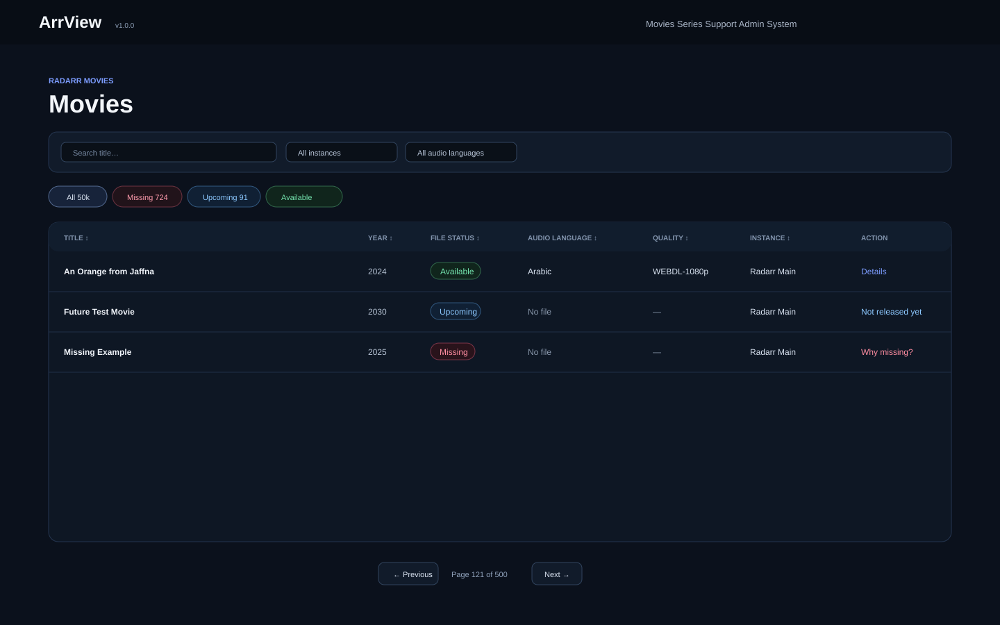
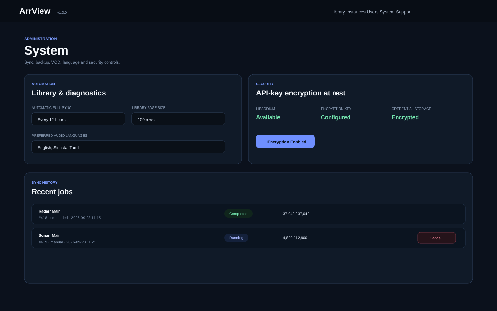

<p align="center">
  
</p>

# ArrView

<p align="center">
  <strong>A compact, self-hosted Radarr & Sonarr library monitor focused on missing media, audio languages, and download diagnostics.</strong>
</p>

<p align="center">
  <a href="https://github.com/kasundigital/ArrView/stargazers"></a>
  <a href="https://github.com/kasundigital/ArrView/pkgs/container/arrview"></a>
  <a href="https://github.com/kasundigital/ArrView"></a>
  <a href="https://buymeacoffee.com/kasundigital"></a>
</p>

<p align="center">
  <a href="#-quick-start">Quick Start</a> •
  <a href="#-features">Features</a> •
  <a href="#-why-arrview">Why ArrView?</a> •
  <a href="#-docker-compose">Docker Compose</a> •
  <a href="#-roadmap">Roadmap</a> •
  <a href="#-support-the-project">Support</a>
</p>

---

## What is ArrView?

**ArrView** gives you one clean place to inspect your Radarr and Sonarr libraries without digging through multiple pages in each `*arr` app.

It is built for a very practical question:

> **What is missing, what language is the file in, and why did it not download?**

Instead of a poster-heavy media browser, ArrView uses a **compact table-first interface** so you can scan hundreds of movies or series quickly.

Typical columns include:

| Title | Year | File Status | Audio Language | Quality / Episodes | Instance | Action |
|---|---:|---|---|---|---|---|
| Movie A | 2026 | Available | English | 1080p | Radarr Main | — |
| Movie B | 2025 | Missing | No file | — | Radarr Main | Why missing? |
| Series A | 2024 | Missing episodes | English, Japanese | 18 / 24 | Sonarr Main | Missing 6 ep. |

---

## 📸 Screenshots

### Large-library view

<p align="center">
  
</p>

### System administration

<p align="center">
  
</p>

---

## ✨ Features

### ✅ v1.0 Stable operations

ArrView 1.0 adds the operational controls needed for long-running self-hosted deployments:

- Database-backed pagination for large movie and series libraries
- Sortable library columns with search, instance, year, status, and audio-language filters
- Independent scheduled full-sync worker with configurable intervals
- Incremental Radarr/Sonarr webhook updates
- Sync history, live progress, and administrator cancellation
- SQLite backup download and validated restore with a pre-restore safety snapshot
- Persistent server-side login throttling
- Optional libsodium encryption at rest for Radarr/Sonarr and personal TMDB credentials
- Multiple global/per-instance VOD path mappings
- Viewer permission control for VOD links
- Preferred audio-language rules and warnings
- Mixed-language series inconsistency detection
- Diagnostic cache TTL display and explicit refresh controls
- Responsive mobile episode cards
- Automated fresh-install, upgrade, 50k-library stress, webhook, restart, recovery, and security regression tests

The new **System** page centralizes sync scheduling/history, VOD mappings, language policy, backup/restore, and security controls.

### 🎬 Radarr movie monitoring

- Compact movie list instead of large poster cards
- Movie title and release year
- Availability-aware status: Available / Upcoming / Missing / Unknown Availability / Unmonitored
- Audio language
- Quality
- Radarr instance name
- Monitored / not monitored status
- Direct **Why missing?** diagnostics

### 📺 Sonarr series monitoring

- Compact series list
- Series release year
- Complete / Missing episodes status
- Episode file count
- Total episode count
- Audio languages detected from episode files
- Sonarr instance name
- Monitored status

### 🔎 Quick filters

Movies:

- **All**
- **Missing** — expected to be available already, but no file exists
- **Upcoming** — release/availability date is still in the future
- **Available**
- **Unknown Availability**
- **Unmonitored**
- **Missing Audio Info**
- **Monitored**

Series:

- **All**
- **Missing**
- **Aired Missing**
- **Complete**
- **Future**
- **Mixed Languages**
- **Preferred Language Warnings**
- **Unmonitored**
- **Missing Audio Info**
- **Monitored**

Both Movies and Series can also be filtered by a **specific cached audio language**.

Every filter includes a count so you can immediately see where attention is needed.

### 🧠 Why Missing? diagnostics

For genuinely missing Radarr movies, ArrView can inspect live Radarr information and help explain why a movie has not been grabbed or imported. Future/unreleased titles are classified as **Upcoming** and are not counted as missing or sent to Deep Search.

Examples include:

- Quality/profile mismatch
- Language mismatch
- Size limits
- Custom-format score
- Blocklisted releases
- Seeder / peer requirements
- Indexer rejection
- Download failure
- Import blocked
- Grabbed but not imported
- Movie not monitored
- No acceptable releases found

The goal is not just to show **Missing**, but to help answer **why**.

### 🔄 Large-library sync

ArrView is designed for large libraries.

- Streaming import instead of decoding one huge Radarr/Sonarr response into memory
- SQLite batch writes
- Live sync progress
- Current item / total count
- Percentage progress
- Current movie or series name
- Background sync jobs
- Configurable scheduled full sync even when nobody is browsing ArrView
- Sync history and cancel controls
- Pagination tested with a 50,000-movie dataset

Example:

```text
1,250 / 8,432   14.8%
█████-------------------------
Interstellar
```

### 👥 User management

ArrView includes authentication with two roles:

**Admin**

- Manage Radarr/Sonarr instances
- Run/test/cancel syncs and inspect sync history
- Manage users
- Configure scheduling, backups, VOD mappings, language rules, and security
- Access the full library

**Viewer**

- Browse/search/filter the library
- No access to instance configuration or user management

### 🧩 Multiple instances

Use more than one:

- Radarr
- Sonarr

You can also filter the library by a specific instance.

---


## ⚙️ System administration

Open **System** as an administrator to configure:

- Automatic full-sync interval or disable scheduled full sync
- Default library page size
- Diagnostic cache TTL
- Preferred audio-language list and warnings
- Viewer VOD permission
- Multiple global or per-instance VOD mappings
- Optional API credential encryption at rest
- Backup download and restore
- Recent sync history and cancellation

### Optional credential encryption

Set a stable encryption key before enabling encryption:

```yaml
environment:
  ARRVIEW_ENCRYPTION_KEY: "your-long-random-secret"
```

A 32-byte random key is recommended. For example:

```bash
openssl rand -hex 32
```

Restart ArrView, then enable encryption from **System → API-key encryption at rest**. Back up the key separately; encrypted credentials cannot be recovered without it.

---

## 🎞️ TMDB Metadata

ArrView can enrich cached Radarr/Sonarr records with TMDB metadata while keeping normal browsing database-first.

- **ArrView Free Metadata** is the default mode and does not require each user to enter a TMDB key.
- Metadata returned by the free service is cached in local SQLite, so opening a movie or series does not repeatedly call TMDB.
- Users with very large libraries can switch to **Use my own TMDB key** in Admin.
- Personal TMDB credentials stay server-side and are never inserted into browser JavaScript.
- Background metadata enrichment shows progress and can process large libraries gradually.
- Radarr/Sonarr webhooks refresh the affected movie/series metadata automatically when possible.
- Movie and series pages show TMDB and IMDb links plus cached overview, runtime, genres, production/network, language, release date and rating.

The public/free metadata service is served by the official ArrView host. The official service host must set:

```text
ARRVIEW_SHARED_TMDB_BEARER_TOKEN=<server-side TMDB bearer token>
ARRVIEW_FREE_METADATA_MONTHLY_LIMIT=1000
```

Normal ArrView installations do **not** need those variables. They use the shared service automatically, or can provide their own TMDB credential from the Admin UI.

TMDB attribution:

> This product uses the TMDB API but is not endorsed or certified by TMDB.

---

## 🔔 Radarr / Sonarr Webhooks

ArrView includes a guided webhook setup on the Support page. For each enabled instance, it shows the generated webhook URL and the recommended Radarr/Sonarr notification triggers to enable.

This keeps ArrView synchronized on file import, upgrade, add/delete, and file-delete events without polling the full library.

---

## 📺 Sonarr Season & Episode View

ArrView now caches Sonarr episodes locally during sync, so normal browsing does not continuously query Sonarr.

- Expand a series into seasons
- Expand seasons into episode tables
- Episode file status
- Aired vs future episode awareness
- Per-episode audio language
- Quality and file size
- File-added date
- File path and release metadata
- Public/VOD links for episode files
- Episode-level **Why Missing?** diagnostics
- **Aired Missing** filter to avoid treating future episodes as failures

## 🧠 Safer diagnostics

Normal diagnostic pages perform a lightweight state/queue/history check first.

A separate **Deep Search** button performs live indexer searching only when needed. Release responses are streamed and displayed with capped results to avoid the large-memory failures that can happen with huge Radarr/Sonarr release responses.

---

## ⭐ Why ArrView?

Radarr and Sonarr are excellent automation tools, but when you manage a large library it can still take time to answer simple operational questions:

- Which movies are still missing?
- Which series are incomplete?
- What audio language does this file contain?
- Which titles have no language metadata?
- Why did Radarr reject every available release?
- Was the download grabbed but never imported?
- Is the movie simply not monitored?
- Which Radarr/Sonarr instance owns this item?

ArrView is intended to make those answers visible from **one compact screen**.

If this solves a problem for you, please consider giving the repository a **⭐ star**. It helps other Radarr/Sonarr users discover the project.

---

## 🚀 Quick Start

No Git clone is required.

```bash
docker run -d \
  --name arrview \
  --restart unless-stopped \
  -p 3223:8080 \
  -v arrview-data:/app/data \
  ghcr.io/kasundigital/arrview:latest
```

Then open:

```text
http://SERVER-IP:3223
```

On the first launch, ArrView will ask you to create the first **Admin** account.

Then:

1. Open **Admin**
2. Add your Radarr and/or Sonarr instance
3. Enter the instance URL and API key
4. Test the connection
5. Run **Sync Now**
6. Watch the live progress bar
7. Open Movies or Series

---

## 🐳 Docker Compose

```yaml
services:
  arrview:
    image: ghcr.io/kasundigital/arrview:latest
    container_name: arrview
    restart: unless-stopped
    ports:
      - "3223:8080"
    environment:
      TZ: Asia/Colombo
      ARRVIEW_DATA: /app/data
      # Optional, only if encryption-at-rest is enabled:
      ARRVIEW_ENCRYPTION_KEY: ${ARRVIEW_ENCRYPTION_KEY:-}
    volumes:
      - arrview-data:/app/data

volumes:
  arrview-data:
```

Start it with:

```bash
docker compose up -d
```

ArrView listens on port `8080` inside the container and the examples expose it as port `3223` on the host.

---

## 🔄 Updating ArrView

Your users, instances, settings, and cached library data are stored in the persistent `arrview-data` Docker volume.

Update with:

```bash
docker pull ghcr.io/kasundigital/arrview:latest

docker stop arrview
docker rm arrview

docker run -d \
  --name arrview \
  --restart unless-stopped \
  -p 3223:8080 \
  -v arrview-data:/app/data \
  ghcr.io/kasundigital/arrview:latest
```

Your existing data remains intact.

---

## 🏗️ Architecture

ArrView is intentionally lightweight:

- **PHP 8.3**
- **SQLite**
- **Docker**
- **Radarr API**
- **Sonarr API**
- No external database required
- No Node.js runtime required
- Independent lightweight PHP scheduler process inside the container
- Automated SQLite migrations for existing installations

Persistent data:

```text
/app/data
```

Default Docker volume:

```text
arrview-data
```

---

## 📦 Docker Image

Published automatically to GitHub Container Registry:

```text
ghcr.io/kasundigital/arrview:latest
```

Supported architectures:

- `linux/amd64`
- `linux/arm64`

---

## 🗺️ Roadmap

ArrView v1.0.0 is the stable baseline. Completed v1 work and future ideas are tracked in [ROADMAP.md](ROADMAP.md). Release history is in [CHANGELOG.md](CHANGELOG.md), and security guidance is in [SECURITY.md](SECURITY.md).

---

## 🤝 Contributing

Contributions, testing, bug reports, feature ideas, and documentation improvements are welcome.

A useful contribution can be as simple as:

- Reporting a Radarr/Sonarr API edge case
- Testing a large library
- Testing ARM64
- Suggesting a useful filter
- Improving diagnostics
- Improving mobile UX
- Updating documentation

If you build something useful, feel free to open a pull request.

---

## 🐛 Bugs & Feature Requests

Please use GitHub Issues:

**https://github.com/kasundigital/ArrView/issues**

When reporting a problem, useful information includes:

- ArrView version
- Radarr/Sonarr version
- Docker platform
- Relevant error message
- Steps to reproduce

Please remove API keys, passwords, private hostnames, and other sensitive information before posting logs publicly.

---

## ☕ Support the Project

ArrView is free and open source.

If it saves you time, helps troubleshoot your media stack, or you simply want to support continued development, you can buy me a coffee:

### ☕ [Buy Me a Coffee — kasundigital](https://buymeacoffee.com/kasundigital)

And if you cannot contribute financially, a **GitHub ⭐ star**, issue report, pull request, or share is just as appreciated.

<p align="center">
  <a href="https://buymeacoffee.com/kasundigital">
    
  </a>
</p>

---

## 🔐 Privacy

ArrView is self-hosted.

Your Radarr/Sonarr URLs, API keys, users, and cached library metadata stay in your own ArrView installation unless you choose to expose or share them. API-key encryption at rest is optional and can be enabled from System after configuring ARRVIEW_ENCRYPTION_KEY.

For security, avoid exposing ArrView directly to the public internet without appropriate authentication, HTTPS, firewall rules, and/or a trusted reverse proxy.

---

## 📜 License

MIT

---

<p align="center">
  Built by <a href="https://www.kasunindika.com">Kasun Indika</a>
  <br>
  <a href="https://github.com/kasundigital/ArrView">GitHub</a> ·
  <a href="https://buymeacoffee.com/kasundigital">Buy Me a Coffee</a>
</p>

<p align="center">
  <strong>If ArrView is useful to you, please ⭐ star the repository and share it with other Radarr/Sonarr users.</strong>
</p>
